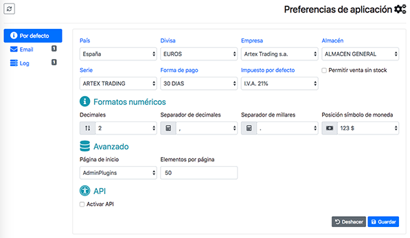

.. highlight:: rst
.. title:: Facturascripts preferencias de la aplicacion
.. meta::
  :http-equiv=Content-Type: text/html; charset=UTF-8
  :generator: FacturaScripts Documentacion
  :description: Las preferencias nos permiten personalizar la aplicacion.
  :keywords: facturascripts, documentacion, preferencias, aplicacion

#############################
Preferencias de la aplicación
#############################

Esta página, ubicada en el menú (:guilabel:`Administrador->Panel de Control->Preferencias de aplicación`),
permite consultar y configurar el comportamiento de la aplicación así como los datos que usarán por defecto.
Los datos se agrupan en pestañas según el grupo de datos o el uso al que pertenecen,
pudiendo ver la lista de pestañas disponibles en una columna a la izquierda de la ventana.
A medida que vayamos instalando y activando nuevos plugins pueden ir apareciendo nuevas pestañas
con los datos de configuración del plugin. Debido a esto pueden aparecer muchos más campos
de los comentados en esta página. Simplemente se comentan los más genéricos.

Por defecto
^^^^^^^^^^^
:País: Indica el país de instalación de la aplicación. Se usa para la creación automática de datos como los impuestos, plan contable, etc.
:Divisa: Divisa base con la que trabaja la aplicación.
:Empresa: Es la empresa por defecto para los documentos.
:Almacén: El almacén por defecto para el tratamiento de stock.
:Serie: La serie de facturas por defecto.
:Forma de pago: Al crear un nuevo cliente, la forma de pago por defecto que se asignará.
:Impuesto: Al crear un producto, el impuesto por defecto que se asignará.
:Decimales: Número máximo de decimales deseados para los importes.
:Separadores: Símbolos utilizado como separadores decimal y de cifra de miles.
:Posición $: Posición donde se visualizará el símbolo de la moneda utilizada.
:Pág. inicio: Página de inicio para nuevos usuarios o usuarios que no han indicado cual es su página de inicio.
:Elementos pág: Número máximo de registros que se muestran en las listas de datos.
:Activar API: Activa la posibilidad de acceso a los datos desde programas de terceros.

Email
^^^^^
Permite establecer la configuración para el envío de mail o notificaciones, así el buzón para
notificaciones administrativas.

:Correo administrativo: Buzón de correo y contraseña para notificaciones administrativas.
:Servidor de correo: Conjunto de datos necesarios para configurar la conexión con el servidor de correo y poder enviar los correos.

Log
^^^
Indica que grupo de mensajes se guardarán en el histórico de mensajes. Sólo los tipos marcados serán archivados para posibles consultas posteriores.
