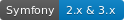
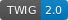
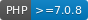

.. title:: Facturascripts Documentación
.. meta::
  :http-equiv=Content-Type: text/html; charset=UTF-8
  :generator: FacturaScripts Documentacion
  :description: Documentación de usuario y ayuda para el desarrollo de Facturascripts 2018
  :keywords: facturascripts, documentacion, desarrollo, plugin

##############
Facturascripts
##############

Software de facturación y contabilidad para PYMES, fácil, libre y con actualizaciones constantes. Es compatible con FacturaLux, Abanq y Eneboo.
Es software libre bajo licencia GNU/LGPL.

Generalidades
=============

.. raw:: html

   <table style="width:100%;">
     <tr>
       <td>

.. toctree::
  :maxdepth: 2

  Overview

.. raw:: html

       </td>
       <td>

.. toctree::
  :maxdepth: 2

  StyleGuide

.. raw:: html

       </td>
     </tr>
   </table>

   

   &nbsp;

   <table style="width:100%;">
     <tr>
       <td style="width:50%;">

.. toctree::
  :caption: Guía de Usuario
  :titlesonly:

  UserGuide/Users

.. raw:: html

      </td>
      <td>
        <em>
          Aprende o resuelve tus dudas sobre el manejo del ERP FS2018.
          Guías paso a paso sobre el uso correcto de todas las funciones de los apartados de la aplicación.
        </em>
      </td>
      </tr>
    </table>

     

     &nbsp;

  <table style="width:100%;">
    <tr>
      <td style="width:50%;">

.. toctree::
  :caption: Guía para el Desarrollo
  :includehidden:
  :titlesonly:

  Developer/Development
  Developer/DataBase
  Developer/DataBaseWhere
  Developer/Tables
  Developer/Models
  Developer/ModelView
  Developer/Views
  Developer/XMLViews
  Developer/Controllers
  Developer/ExtendedControllers
  Developer/ListController
  Developer/EditController
  Developer/PanelController
  Developer/InteractWithViews

.. raw:: html

      </td>
      <td>
        <em>
          Aprende los conceptos básicos y todas las novedades incluidas en esta versión, para poder desarrollar sin problemas.
          Crea tus propios Plugins y personalizaciones, ajustando a tus requisitos el aplicativo y mejorando la experiencia de uso.
        </em>
      </td>
    </tr>
  </table>
